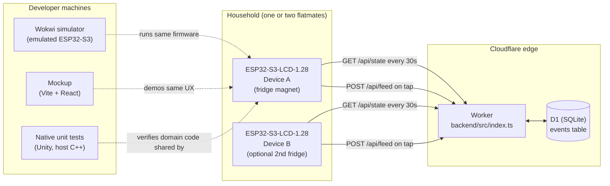
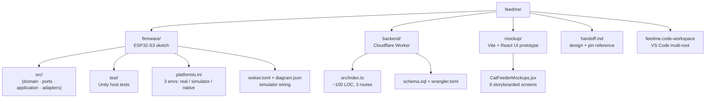
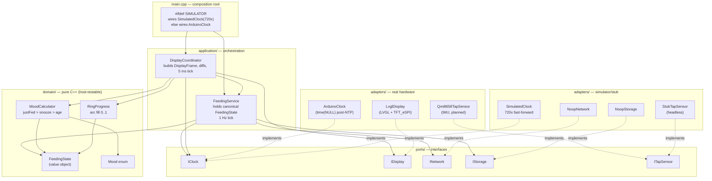
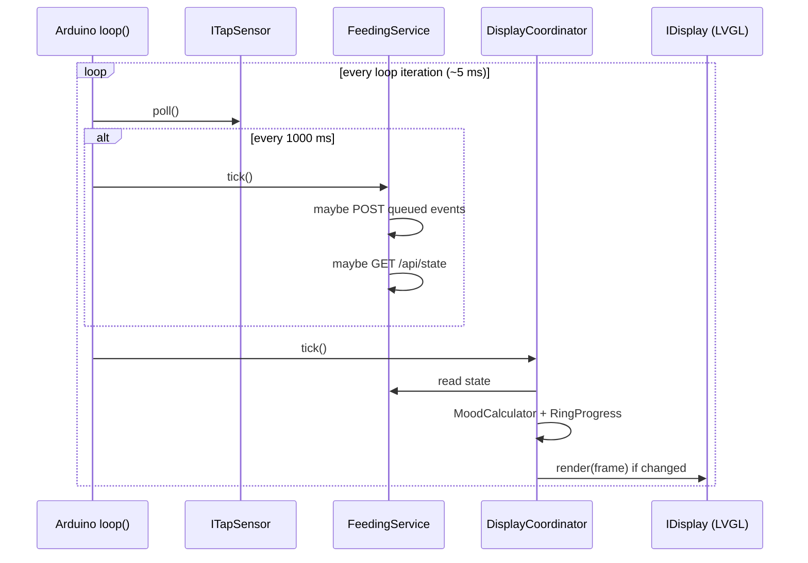
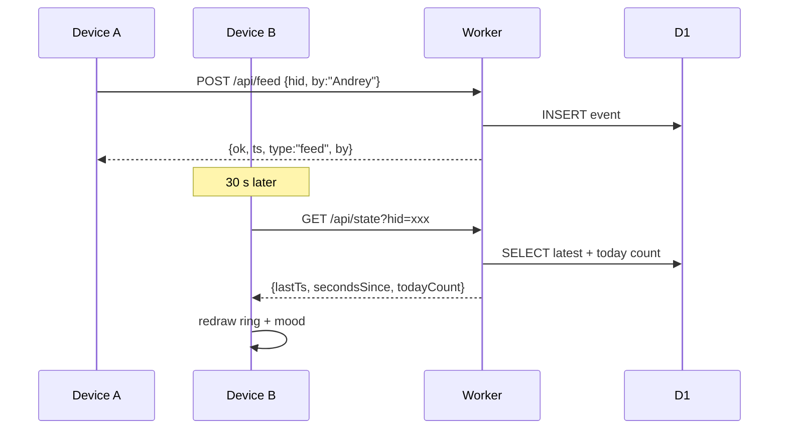
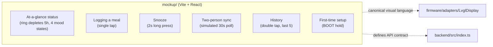
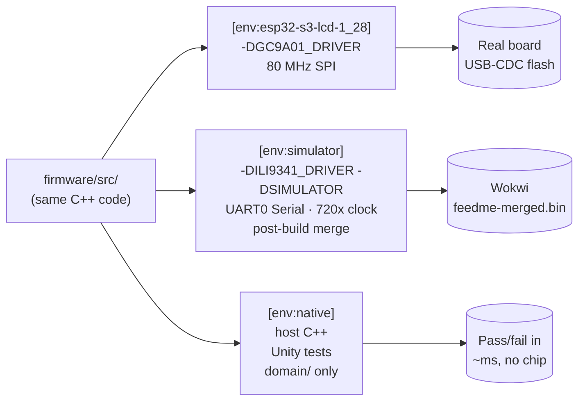

# feedme — Architecture & Tooling

> Companion to [handoff.md](../handoff.md) and [README.md](../README.md). This
> document explains *why* the codebase is split the way it is, draws the
> moving parts, and inventories every tool/library/IDE in use with free
> alternatives.

---

## 1. System overview

**Why three runnable targets and a backend?** A single ESP32-S3 is enough to
*display* state, but four orthogonal forces pulled the codebase into the
shape it has:

1. **A household with N users feeding N cats** → exactly one household, 1..N
   devices (today 1, but `deviceId` is passed everywhere so multi-device is
   a backend change only), 1..N users, 1..N cats. UI never offers selectors
   for entities of cardinality 1 — see
   [handoff.md § "Entities: household, devices, users, cats"](../handoff.md)
   for the per-screen scope table and the backward-compatible D1 evolution.
   State must outlive any single device's RAM, so a small backend acts as
   the source of truth.
2. **No hardware in front of you most of the time** → a simulator + a web
   mockup let UX work happen on a laptop.
3. **Pure logic doesn't need the chip** → the mood/ring math is tested as
   plain C++ on the host; it would be cruel to flash a board to verify a
   threshold comparison.
4. **Two display drivers (GC9A01 real, ILI9341 simulator)** → the firmware is
   driver-agnostic above the adapter layer.

---

## 2. Top-level repository layout

| Folder | Purpose | Why it's separate |
|---|---|---|
| `firmware/` | Code that runs on the ESP32-S3-LCD-1.28 | Different toolchain (xtensa GCC + PlatformIO), different build artifact (.bin), and unit-testing the pure parts is easier when the chip-specific code lives behind a clean port boundary. |
| `backend/` | Cloudflare Worker + D1 database serving 3 JSON endpoints | A device cannot be the source of truth: it might be off, low battery, or replaced. The Worker holds the canonical event log so a second device — or a phone, in a future v2 — sees the same picture. Hosting on Workers means zero servers to operate and free-tier capacity covers an entire neighborhood of households. |
| `mockup/` | Vite + React storyboards of the six user workflows | Lets UX iterate in the browser without flashing or simulating. Acts as living design documentation; `CatFeederMockups.jsx` is the canonical reference for the four-mood visual language that the firmware later implements in LVGL. |
| `handoff.md` | Hardware pin map, design intent, build phases | Single source of truth for non-code decisions; intentionally outside any subproject so it isn't tied to a tool's lifecycle. |
| `feedme.code-workspace` | VS Code multi-root config | Lets one window own all three subprojects with their own extensions (PlatformIO for firmware, ESLint for the others). |

---

## 3. Firmware — hexagonal architecture

### Why the four layers

| Layer | What lives here | Why split |
|---|---|---|
| **domain/** | `FeedingState`, `Mood`, `MoodCalculator`, `RingProgress`. Pure functions and value objects; no Arduino, no LVGL. | This code is the *product*: when is the cat hungry, what colour is the ring. Keeping it pure means it compiles on the host and runs in `pio test -e native` in milliseconds — no flash cycle, no simulator. |
| **ports/** | `IClock`, `IDisplay`, `INetwork`, `IStorage`, `ITapSensor` (abstract interfaces). | Inverts dependencies. The application layer talks to these, not to TFT_eSPI or HTTPClient. Replacing a real adapter with a stub is a one-line change at the composition root. |
| **application/** | `FeedingService` (owns state, ticks at 1 Hz), `DisplayCoordinator` (builds frames, diffs, 5 ms tick). | This is where *time* lives. Pure domain code can't say "every second", "fade for 200 ms", "poll every 30 s" — the application layer turns user gestures and clock ticks into state transitions. |
| **adapters/** | Concrete implementations: `LvglDisplay`, `ArduinoClock`, `SimulatedClock`, `NoopNetwork`, `NoopStorage`, `StubTapSensor`. | Everything that knows about a specific library, GPIO pin, or HTTP path is here. Easy to swap: simulator mode picks `SimulatedClock` + the `ILI9341` build flag; production mode picks `ArduinoClock` + `GC9A01`. |

### Runtime tick model

---

## 4. Backend — minimal coordinator

**Why a backend at all?** Two devices need to share state. Direct device-to-device
sync (BLE / mDNS) would couple their lifecycles and waste battery. A tiny
edge Worker is cheaper, survives a device replacement, and unlocks future
phone clients without a firmware change. D1 (SQLite at the edge) is overkill
for one cat but free, durable, and lets `GET /api/history` answer in one
indexed query.

**API surface (authoritative — see [backend/src/index.ts](../backend/src/index.ts)):**

| Verb | Path | Purpose |
|---|---|---|
| `GET`  | `/api/state?hid=<household>` | Last event ts, seconds since, today's meal count |
| `POST` | `/api/feed` body `{hid, by, type?, note?}` | Append `feed` or `snooze` event |
| `GET`  | `/api/history?hid=<household>&n=5` | Last N events (capped at 50) |

No auth in MVP; `hid` is a semi-private identifier. A real product would add
HMAC headers or a short token — flagged as v2.

---

## 5. Mockup — design surface

**Why a separate React app?** The cat face and the four colour states are the
*product*. Iterating on them in a browser dev loop (≈100 ms reload) is an
order of magnitude faster than rebuilding firmware (≈15 s) and reflashing
(≈10 s) — and the LVGL rendering work later is just a port of an already-
agreed visual. The mockup is intentionally network-free; it shows *intended*
behaviour, not real data.

---

## 6. Three build envs in one PlatformIO project

The split is what made the boot loop your screenshot showed possible: the
common build flags enable USB-CDC-on-boot for the real device, but Wokwi's
serial monitor is wired to UART0. The simulator env now strips those flags
so `Serial.println` reaches the monitor, and `wokwi.toml` points at the
**merged** image (`feedme-merged.bin`, bootloader + partitions + app at
offset 0) instead of the bare app `firmware.bin`.

---

## 7. Tools, libraries, IDEs — and free alternatives

Every entry below is something a contributor needs to install, log into, or
choose. Free alternatives are listed only where the current pick has a paid
tier or vendor lock-in worth flagging.

### IDEs and editors

| Tool | Used for | Cost | Free alternatives |
|---|---|---|---|
| **VS Code** | Primary editor; multi-root workspace ties firmware/backend/mockup together. | Free, MIT-licensed core. | **VSCodium** (same UI, telemetry-stripped, no proprietary marketplace — fine for OSS extensions). **Cursor** if you want stronger AI; not free. **JetBrains CLion** for C++ has better refactoring but requires a licence. |
| **PlatformIO IDE (VS Code extension)** | Build/upload/monitor for the ESP32-S3 firmware; manages toolchain and library deps. | Free; PlatformIO Labs sells a paid "PIO Plus" tier (debug, unit-test UI niceties) but the core CLI is enough for everything in this repo. | **Arduino IDE 2.x** (simpler, but no envs/library-dep graph — you'd lose the three-env split). **ESP-IDF + idf.py** directly (steeper learning curve, drops Arduino abstractions). |
| **Wokwi for VS Code** | Browser/IDE simulator that emulates the ESP32-S3 + ILI9341 wiring in `diagram.json`. | Free hobbyist licence (sign-in once). Paid plans add private projects, CI, longer simulation runs. | **QEMU + esp-idf qemu fork** (no display widgets, painful UX). **Renode** (general MCU emulation, no LCD parts out of the box). For pure logic, the `pio test -e native` host tests usually obviate the simulator. |
| **Wrangler CLI** (Cloudflare) | Local Worker dev server, D1 migrations, deploys. | Free. Cloudflare's free tier (Workers + D1) covers this project's traffic forever. | **Miniflare** (now bundled inside Wrangler — same thing). For a self-hosted equivalent: **Hono** on **Bun** + **SQLite** + a $5/mo VPS — more ops, but no vendor lock-in. **Deno Deploy** is a similar serverless option but no SQLite-at-edge equivalent yet. |
| **Even Better TOML / ESLint / Prettier / C/C++ extensions** | Editor support for `wokwi.toml`, `platformio.ini`, JS/TS, C++. | Free. | All three have first-class free OSS alternatives already; no swap needed. |

### Firmware toolchain & libraries

| Tool/Library | Used for | Cost | Free alternatives |
|---|---|---|---|
| **Espressif Arduino core (espressif32 platform 6.x)** | Arduino-flavoured wrapper around ESP-IDF; what `framework = arduino` pulls in. | Free, Apache 2.0. | **ESP-IDF** directly — same SoC support, more code but smaller binaries and finer power control. **NuttX** or **Zephyr** for a real RTOS (overkill here). |
| **TFT_eSPI** (`bodmer/TFT_eSPI@^2.5.43`) | SPI display driver — handles GC9A01 on the real board, ILI9341 in the sim. Configured via `-D` flags so we don't fork `User_Setup.h`. | Free, FreeBSD-style licence. | **LovyanGFX** — actively maintained, supports more panels, slightly nicer API. Worth migrating to if TFT_eSPI's `User_Setup` system becomes a maintenance burden. **Arduino_GFX** (Moon On Our Nation) is another option. |
| **LVGL 8.4** (`lvgl/lvgl@^8.4.0`) | Widget toolkit / scene graph; arc, labels, animations. | Free, MIT. | None at the same feature level on MCUs. **TFT_eSPI's built-in primitives** suffice for a v0 (just the arc + a face), but you give up animations and font management. |
| **ArduinoJson 7** (`bblanchon/ArduinoJson@^7.2.0`) | Parse `/api/state` responses, build POST bodies. | Free, MIT. Has a "sponsor" model. | **cJSON** — smaller, plain C, less ergonomic. **JsonStreamingParser** for memory-tight cases. |
| **Unity** (PIO `test_framework = unity`) | Host-side unit tests for `domain/`. | Free, MIT. | **Catch2 / doctest** — header-only, nicer macros, but PIO's `unity` integration is one config line. |
| **esptool.py** (bundled by PIO) | Merges bootloader + partitions + app into `feedme-merged.bin`. | Free, GPL2. | None — it's the official tool. |

### Backend stack

| Tool | Used for | Cost | Free alternatives |
|---|---|---|---|
| **Cloudflare Workers** | Hosts the 3 JSON routes at the edge. | Free tier: 100k req/day. This project is far below that. Beyond: $5/mo for 10M req/day. | **Deno Deploy** (similar UX, free tier), **Vercel Edge / Netlify Functions** (slightly different DX). For self-hosting: **Hono on Bun/Node** + nginx on a $4/mo VPS (Hetzner). |
| **Cloudflare D1** | SQLite at the edge for the `events` table. | Free tier: 5 M reads/day, 100 k writes/day, 5 GB storage. Wildly more than needed. | **Turso** (SQLite-compatible, free tier ≥ D1's). **Neon** (Postgres, free tier). Self-host: **SQLite file** mounted into the VPS — you'd lose multi-region replication. |
| **TypeScript** | Worker source language. | Free. | Plain JS works fine for a 100-LOC Worker if you dislike the TS step; you keep your editor's IntelliSense via JSDoc. |

### Mockup stack

| Tool | Used for | Cost | Free alternatives |
|---|---|---|---|
| **Vite** | Dev server + build for the React mockup. | Free, MIT. | **Parcel** (zero-config, slower HMR). **esbuild + a 5-line server**. **Next.js** if SSR was wanted (it isn't). |
| **React 19** | UI framework for the storyboards. | Free, MIT. | **SolidJS** (smaller, faster, similar JSX). **Svelte** (less boilerplate). For a visual-only mockup, **plain HTML + CSS + a `<script type="module">`** would also do — React buys you the hot-swappable component story. |
| **TypeScript** | Type checker for the mockup. | Free. | Plain JSX. |

### Hardware (referenced for completeness)

| Item | Cost | Free alt |
|---|---|---|
| Waveshare ESP32-S3-LCD-1.28 | ~$22 | None — the round 1.28″ GC9A01 + IMU combo at this price is unique. **Closest analogue:** generic ESP32-S3 dev kit + standalone GC9A01 + standalone QMI8658, more wiring, similar BOM. |
| Battery, magnets, case | a few dollars each, see [handoff.md](../handoff.md) | Case STL is free on Thingiverse. |

### Summary of the "could be free-er" picks

1. **VS Code → VSCodium** if you care about telemetry; the Wokwi extension and PlatformIO both work in VSCodium via the OpenVSX registry.
2. **TFT_eSPI → LovyanGFX** if/when the hand-rolled `-D` flags become annoying.
3. **Cloudflare Workers/D1 → Hono + SQLite on a Hetzner VPS (€4/mo)** if vendor independence becomes a goal — note "free-er" here means "no vendor lock", not "cheaper", since the CF free tier is genuinely free.

Everything else in the stack is already best-in-class free / OSS for its job
and swapping would be churn.
