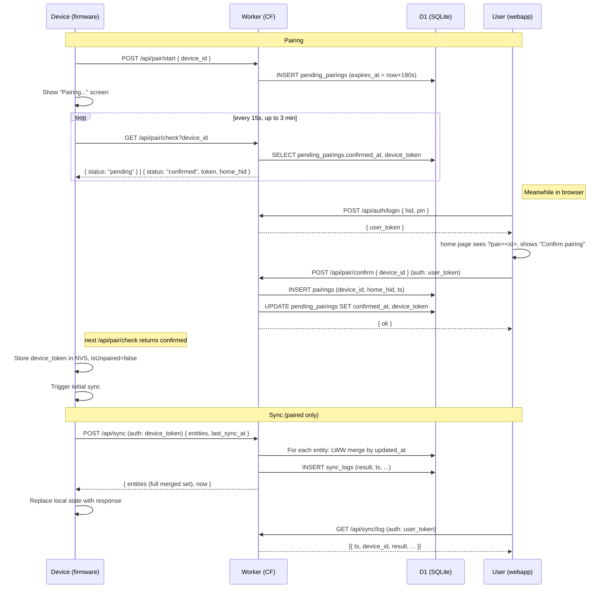

# Sync Implementation Handoff

> Companion to [docs/architecture.md](architecture.md) and the existing
> migrations under `backend/migrations/`. This document is a planning
> artifact for the **multi-device synchronization** rework requested
> in dev-22 brief. Read top-to-bottom: §1–3 set the goals and the
> questions you should answer before §4 onward become final. The doc
> is opinionated where the spec was silent — those defaults are called
> out as **Suggested**, and the user is invited to reverse them
> before code lands.

---

## 1. Goals & Non-Goals

### Goals (from the brief)

1. **Bi-directional sync** of `home`, `cat`, `user`, `schedule` between
   any number of paired devices and the central D1 (Cloudflare) store.
2. **Last-Write-Wins (LWW)** conflict resolution per entity, driven by
   a monotonic `updated_at` timestamp on every row.
3. **Soft delete** via an `is_deleted` boolean (or equivalent) so a
   deletion on one device propagates to the others without losing the
   row's history.
4. **Pairing flow** that's resumable across the device's `Pair` and
   `Reset` actions, with a confirmation step on the webapp side and a
   long-poll handshake on the device side. 3-min timeout, cancellable
   from both ends.
5. **Unpaired mode** on the device — visual presence + local-only
   bookkeeping; sync calls are skipped except the pairing handshake.
6. **Sync log** persisted per home, viewable from the webapp dashboard.
7. **Periodic background sync** while the device is in display sleep,
   default every 4 h, configurable.
8. **UX**: "Syncing" progress screen on the device with cancel-by-long-tap;
   a 1-second post-success grace on every progress screen (Pouring,
   Syncing, Pairing) so the user always reads the result before
   transitions.

### Non-Goals (deferred)

- **Real-time push** from server to device. Sync is poll-based — the
  device pulls when it wants, the server doesn't push.
- **CRDT / per-field merge.** LWW operates on whole entity rows; if
  device A renames a cat and device B changes its color simultaneously,
  one whole row wins. Field-level merging is a future enhancement.
- **Offline event-store reconciliation** for `events` (feedings).
  Events are append-only and already use a UUID-based idempotency key
  (`event_id`). Existing `/api/feed` semantics stay unchanged; the
  sync described here covers the *configuration* entities only.
- **Cross-home cat/user moves.** A cat lives in one home for life.
- **Device-token revocation UI.** Forgotten device → manual
  `wrangler d1 execute` for now.

---

## 2. Locked decisions

> All ten questions originally posed in this section have been
> answered and the recommendations accepted. The table below is
> kept as a record so reviewers can trace why each call was made;
> the rest of the doc (§3 onward) is now the binding spec.

| # | Decision | Why | Reversal cost if it's wrong |
|---|---|---|---|
| Q1 | **UUIDs on cats and users.** Add `uuid TEXT` (16-hex) to both tables; backfill via `randomblob(16)` for existing rows. `slot_id` stays as per-device display ordering. Sync wire format keys on `uuid`. | Without UUIDs, two unpaired devices that each create slot 0 lose one cat on first sync. Cheap to add now; painful to bolt on later. | Migrating later requires re-deduping any existing collisions by hand. |
| Q2 | **Schedule embedded in Cat.** No separate `cat_schedules` table — slot hours stay as columns / array on the cat row. | Cat row's `updated_at` bumps on any field change including schedule. Saves a join + simplifies merge. | Field-level conflicts on cats stay coarse (whole-row LWW). Same coarseness as Q1 covers. |
| Q3 | **3-tier sleep + sync at sleep-entry AND wake-entry.** Active → display-sleep (LCD off, CPU on) → light-sleep (~1 mA, wakes <1 ms on encoder/touch). At each sleep transition AND each wake transition: if `now - lastSyncAt > syncIntervalSec`, kick a sync (show Syncing screen, hold transition until done/fail). No RTC timer wake-up. | Deep sleep with input wake isn't possible on this board (encoder pins 41/42/45 are outside the ESP32-S3 RTC GPIO range 0-21). Light sleep gives ~50× power savings over today and keeps the knob alive. Sync at sleep-entry covers "I just walked away"; sync at wake-entry covers "I just came back" so a long-idle device doesn't show stale data the moment the user picks it up. | A battery variant could later layer deep-sleep timer-wake on top for the periodic-sync path; not needed for USB-powered v1. |
| Q4 | **Short-poll on `GET /api/pair/check`** every 15 s, 3-min total. Server returns the row's current state; client drives cadence. No long-polling, no Durable Object. | Stateless serverless fits Workers' execution model; testing is straightforward. Long-polling would cut median pair time by ~7.5 s — not worth the DO dependency. | Migration to long-poll is a server-only change; client cadence stays the same. |
| Q5 | **Random 16-hex device ID after Reset.** `feedme-{16 hex chars from esp_random()}`. Existing devices keep their MAC-derived id forever for back-compat (the legacy-claim path covers them). | Stays close to current naming; full UUIDv4 (36 chars) bloats URLs and NVS for no real benefit at this scale. | None — collision probability of 16-hex over our population is effectively zero. |
| Q6 | **Ring buffer of 100 sync logs per home.** After-insert prune: `DELETE WHERE id NOT IN (SELECT id FROM sync_logs WHERE home_hid=? ORDER BY ts DESC LIMIT 100)`. | ~1 KB × 100 = 100 KB / home — well within D1 free tier. Surfaces the most recent useful history, doesn't grow unbounded. | Trivial to bump the limit later if users want longer history. |
| Q7 | **Sync interval setting lives in webapp only** (Settings → Sync interval, range 1-24 h, default 4). Device caches the value from each sync response. | Avoids growing the device-side editor surface. The only reason to pair is to get webapp access anyway, so "set from web" is no extra burden. | If you ever want offline-only configurability, add a device editor in `SettingsView`. |
| Q8 | **Two token types.** `UserToken { type: "user", hid, exp: 30d }` and `DeviceToken { type: "device", hid, deviceId, exp: 365d }`. Same HMAC secret signs both; `authFromRequest` returns a discriminated union. | Decouples device-pairing lifetime from user-session lifetime. User logs out → device keeps syncing. Device unpaired → user session unaffected. | Single-token-with-roles would couple the two lifetimes — bad UX. |
| Q9 | **Don't tighten `/api/feed` auth in this rework.** Stays unauthenticated, accepts any `hid`. Tighten in dev-23 once all live devices have a token. | Tightening now would break every shipped device until re-pair. Phased rollout is gentler. | Until tightened, anyone with a hid can spoof feed events. Low real-world risk on a personal-use system. |
| Q10 | **Confirm-pairing banner on Home dashboard.** Triggered by `?pair=<deviceId>` query param (carried through `/setup` → `/login` → `/`) OR `localStorage.feedme.pendingPair` (survives reload). Auto-clears on confirm or dismiss. | Single visible CTA on the page the user already lands on after auth. No new route needed. No persistent admin UI surface to maintain. | Trivial to lift the banner into a dedicated `/devices/pair-pending` route later if it gets crowded. |

---

## 3. Architecture overview



---

## 4. Schema changes

### 4.1 New columns on existing tables

All entity tables get the same triplet:

| Column | Type | Default for backfill | Purpose |
|---|---|---|---|
| `created_at` | INTEGER | `0` if NULL on read; populated on next sync | First-write timestamp (immutable) |
| `updated_at` | INTEGER | same as `created_at` | Bumped on every UPDATE; **drives LWW** |
| `is_deleted` | INTEGER (0/1) | `0` | Tombstone flag; replaces `deleted_at` semantics |

`deleted_at` (existing on `cats`/`users`) stays in the schema for
back-compat but new code reads `is_deleted`. Migration sets
`is_deleted = (deleted_at IS NOT NULL)` and `updated_at = COALESCE(deleted_at, created_at)`.

### 4.2 New tables

```sql
-- Pending pairing handshake (3-min TTL).
-- Created when device taps "continue pairing"; consumed when user
-- clicks "Confirm pairing" in the webapp. After confirmation, the
-- row holds the issued device_token until the device polls and
-- collects it; then the row may be GC'd by a cron purge (or just
-- left to age out — no harm).
CREATE TABLE IF NOT EXISTS pending_pairings (
  device_id     TEXT PRIMARY KEY,
  requested_at  INTEGER NOT NULL,
  expires_at    INTEGER NOT NULL,         -- requested_at + 180
  home_hid      TEXT,                     -- NULL until confirmed
  confirmed_at  INTEGER,                  -- NULL until confirmed
  device_token  TEXT,                     -- NULL until confirmed
  cancelled_at  INTEGER                   -- NULL unless user/device cancelled
);

-- Pairing relationship. Created on confirm; soft-deleted on Reset.
-- A device has at most one *active* pairing (is_deleted=0); a home
-- has many (one row per paired device). Composite unique on
-- (device_id, is_deleted=0) is enforced in code, not at the DB
-- level (SQLite partial-unique-index works but adds churn).
CREATE TABLE IF NOT EXISTS pairings (
  id            INTEGER PRIMARY KEY AUTOINCREMENT,
  device_id     TEXT NOT NULL,
  home_hid      TEXT NOT NULL,
  created_at    INTEGER NOT NULL,
  updated_at    INTEGER NOT NULL,
  is_deleted    INTEGER NOT NULL DEFAULT 0
);
CREATE INDEX IF NOT EXISTS idx_pairings_device  ON pairings(device_id);
CREATE INDEX IF NOT EXISTS idx_pairings_home    ON pairings(home_hid);

-- Sync audit log. One row per sync attempt (success or failure),
-- per home. Capped to last 100 per home by an after-insert prune.
CREATE TABLE IF NOT EXISTS sync_logs (
  id              INTEGER PRIMARY KEY AUTOINCREMENT,
  home_hid        TEXT NOT NULL,
  device_id       TEXT NOT NULL,
  ts              INTEGER NOT NULL,        -- when the sync ran
  result          TEXT NOT NULL,            -- 'ok' | 'error' | 'cancelled'
  error_message   TEXT,                     -- NULL on success
  entities_in     INTEGER NOT NULL DEFAULT 0,  -- count uploaded by device
  entities_out    INTEGER NOT NULL DEFAULT 0,  -- count returned to device
  conflicts       INTEGER NOT NULL DEFAULT 0,  -- # rows where server LWW won
  duration_ms     INTEGER NOT NULL DEFAULT 0
);
CREATE INDEX IF NOT EXISTS idx_sync_logs_home_ts ON sync_logs(home_hid, ts DESC);
```

### 4.3 If Q1 is "yes" — UUIDs on cats / users

```sql
-- Add uuid column. SQLite has no built-in UUID gen; backfill via
-- randomblob() in migration, then enforce NOT NULL going forward.
ALTER TABLE cats  ADD COLUMN uuid TEXT;
ALTER TABLE users ADD COLUMN uuid TEXT;
UPDATE cats  SET uuid = lower(hex(randomblob(16))) WHERE uuid IS NULL;
UPDATE users SET uuid = lower(hex(randomblob(16))) WHERE uuid IS NULL;
CREATE UNIQUE INDEX IF NOT EXISTS idx_cats_uuid  ON cats(uuid);
CREATE UNIQUE INDEX IF NOT EXISTS idx_users_uuid ON users(uuid);
-- (hid, slot_id) stays as a unique index for current code paths;
-- writes go through both columns until firmware switches to uuid
-- as the primary identifier.
```

### 4.4 Migrations to write

| # | File | Idempotent? |
|---|---|---|
| 0005 | `0005_entity_timestamps.sql` — `ALTER TABLE … ADD COLUMN created_at, updated_at, is_deleted` for households, cats, users, devices. Backfill from `created_at`/`deleted_at` where present. | ALTER ADD: errors with "duplicate column" if re-run. Caught by deploy script. |
| 0006 | `0006_sync_tables.sql` — `pending_pairings`, `pairings`, `sync_logs`. All `CREATE TABLE IF NOT EXISTS`. | Yes |
| 0007 | `0007_entity_uuids.sql` (Q1 yes) — uuid column + backfill + unique index. | `ADD COLUMN` errors on duplicate; UPDATE is idempotent; CREATE INDEX IF NOT EXISTS. |
| 0008 | `0008_devices_evolution.sql` — drop the old `joined_at`-only model; rename `home_hid` to keep backward-compat with existing code paths. (Could be folded into 0005; keep separate for clarity.) | Yes |
| 0009 | `0009_pin_optional.sql` — `ALTER TABLE households` to allow `pin_salt` / `pin_hash` NULL (transparent accounts). | Already nullable in SQLite if not declared `NOT NULL` originally; current schema declares them `NOT NULL`. Migration drops the constraint via `CREATE TABLE … AS SELECT` rebuild. **Not idempotent — runs once per DB.** |
| 0010 | `0010_login_qr_tokens.sql` — `CREATE TABLE login_qr_tokens` for one-shot device-to-web login codes (60 s TTL). | Yes |

---

## 5. Sync protocol

### 5.1 Wire format

```ts
// POST /api/sync (auth: device token)
// Device sends its full local state. Server merges, returns merged.
interface SyncRequest {
  schemaVersion: 1;
  deviceId:      string;
  lastSyncAt:    number | null;   // unix sec; null on first sync
  home: {
    name:        string;          // = hid (post-migration-0004)
    updatedAt:   number;
  };
  cats: SyncCat[];
  users: SyncUser[];
}

interface SyncCat {
  uuid:               string;     // (Q1 yes) global identifier
  slotId:             number;     // device-local 0..3
  name:               string;
  color:              number;
  slug:               string;
  defaultPortionG:    number;
  hungryThresholdSec: number;
  scheduleHours:      number[];   // 4 ints, hours 0..23 (one per meal slot)
  createdAt:          number;
  updatedAt:          number;
  isDeleted:          boolean;
}

interface SyncUser {
  uuid:        string;
  slotId:      number;
  name:        string;
  color:       number;
  createdAt:   number;
  updatedAt:   number;
  isDeleted:   boolean;
}

// 200 OK: server's merged view (the new source-of-truth state).
interface SyncResponse {
  schemaVersion: 1;
  now:           number;          // server clock; device caches as nextLastSyncAt
  home:          { name: string; updatedAt: number };
  cats:          SyncCat[];       // includes is_deleted=true rows so device can drop them locally
  users:         SyncUser[];
  conflicts:     number;          // # rows where server's updated_at > client's
  syncIntervalSec: number;        // pulled from home settings; device overrides its NVS value
}
```

### 5.2 Merge rules (server-side)

For each incoming entity (cat / user / home):

```
client_uat = incoming.updatedAt
server_row = SELECT … WHERE uuid = incoming.uuid (or PK fallback)

if server_row is null:
    INSERT incoming verbatim                 (new entity from device)
elif client_uat > server_row.updated_at:
    UPDATE server_row from incoming          (device wins)
    conflicts++ if abs(client_uat - server_row.updated_at) < 5s  // racey edits
else:
    leave server_row alone                   (server wins → returned as-is)
```

For entities present on the **server** but missing from the **device**:

- If `server_row.is_deleted == false` AND device is the *only* paired
  device → leave alone (device may have just lost local state). Return
  it in the response so device repopulates.
- If `server_row.is_deleted == true` → return it; device drops locally.

**Tombstones never expire.** A `cat.is_deleted=true` row stays in the
DB forever (or until the home is forgotten). This ensures a device
that's been offline for 6 months and comes back online still learns
that the cat was removed, instead of resurrecting it.

### 5.3 Atomicity

Each `/api/sync` request runs in a single D1 batch (`prepare(...).batch([...])`)
so one device's request lands wholly or not at all. Concurrent
requests from two devices on the same home are serialized by D1's
write isolation — second request sees first's effects.

### 5.4 Failure modes

| Symptom | Server returns | Device displays |
|---|---|---|
| Bad token | 401 | "Sync failed — re-pair from H menu" |
| `pending_pairings` says cancelled | 410 Gone | "Pairing cancelled" → reset isUnpaired |
| D1 write fails mid-batch | 500 | "Sync failed — retry" |
| User cancelled (long-tap) | client-side abort | "Cancelled" |

Every outcome writes a `sync_logs` row before responding (or, for
client-side cancel, the device sends a follow-up `POST /api/sync/log`
after the abort).

---

## 6. Auth model

### 6.1 Token shapes

```
token = base64url(payload).base64url(hmacSha256(secret, payloadB64))

UserToken:
  { type: "user",   hid: string,                exp: <30d from issue>  }

DeviceToken:
  { type: "device", hid: string, deviceId: string, exp: <365d from issue> }
```

Same HMAC secret (`AUTH_SECRET`) signs both. `authFromRequest` is
extended:

```ts
interface AuthInfo {
  type:     "user" | "device";
  hid:      string;
  deviceId?: string;
}
```

### 6.2 Endpoint matrix

| Endpoint | Required token | Notes |
|---|---|---|
| `POST /api/auth/login`, `/setup` | none | issues UserToken |
| `POST /api/pair/start` | none | takes device_id from body |
| `GET /api/pair/check?device_id=X` | none | by-design unauthed; protected by short TTL + opaque device_id |
| `POST /api/pair/confirm { deviceId }` | UserToken | issues DeviceToken |
| `POST /api/sync` | DeviceToken | |
| `POST /api/sync/log` (client-side cancel report) | DeviceToken | |
| `GET /api/sync/log` (read-only, for webapp viewer) | UserToken | |
| `DELETE /api/pair/{deviceId}` (unpair from device side) | DeviceToken | |
| `DELETE /api/pair/{deviceId}` (unpair from webapp settings) | UserToken | overload — same path, different token type |
| `GET /api/dashboard/cats` etc | UserToken | (existing) |
| `POST /api/feed`, `/api/state` | none (legacy) | tighten in dev-23 |
| `POST /api/auth/quick-setup { deviceId }` | none | NEW — transparent home; see §6.3 |
| `POST /api/auth/login-token-create` | DeviceToken | NEW — short-lived QR login token; see §6.4 |
| `POST /api/auth/login-qr { deviceId, token }` | none | NEW — exchange QR token for UserToken |
| `POST /api/auth/set-pin { pin }` | UserToken | NEW — upgrade transparent → PIN-protected |

### 6.3 Transparent accounts (no PIN, no chosen name)

A *transparent* home is one with `pin_salt = pin_hash = NULL` — no
PIN, no PIN-protected login. The hid is auto-generated (`home-{8hex}`).
Anyone with possession of (or knowledge of) a paired device can sign
in to it. Designed for the user who wants the device working in 30
seconds without picking a name or memorising a PIN.

**Lifecycle**:

1. **Creation** (`POST /api/auth/quick-setup { deviceId }`):
   - Server generates `hid = "home-" + 8 random hex`.
   - Inserts `households (hid, pin_salt=NULL, pin_hash=NULL, …)`.
   - Atomically claims the device into the new home.
   - Issues a UserToken AND sets a session cookie (see §6.5).
   - Returns `{ token, hid }`.
2. **Re-login** (cookie OR QR): see §6.4 for QR; cookie auto-renews.
3. **Upgrade** (`POST /api/auth/set-pin { pin }` with auth): turns
   the home into a regular PIN-protected account. After upgrade, the
   QR-login path still works for already-paired devices but the
   `/login` page now requires the PIN.
4. **Demotion** (drop the PIN): not supported. PIN-protected → PIN-protected forever.

The webapp Settings → "Set a PIN" entry is the canonical upgrade
path. Banner on the dashboard for transparent accounts ("Add a PIN
for security →") is a v2 nudge.

### 6.4 Login QR (device-side login screen)

A *separate* QR from the pairing one. Shown by an already-paired
device when the user picks **H menu → Login QR**. Lets a phone log
in to the home that owns this device — useful when the user opens
the webapp on a device with no cookie / cleared storage.

Two endpoints:

```
POST /api/auth/login-token-create        (auth: DeviceToken)
  body: {}
  → { token: "xxxx-xxxx-xxxx-xxxx", expiresAt: <epoch+60s> }

POST /api/auth/login-qr                  (auth: none)
  body: { deviceId, token }
  → { userToken, hid } + Set-Cookie session
```

Server keeps a `login_qr_tokens` table (TTL = 60 s, one-time use):

```sql
CREATE TABLE IF NOT EXISTS login_qr_tokens (
  token       TEXT PRIMARY KEY,    -- 16-char random
  device_id   TEXT NOT NULL,
  home_hid    TEXT NOT NULL,
  expires_at  INTEGER NOT NULL,
  consumed_at INTEGER              -- NULL until /api/auth/login-qr called
);
```

QR encodes:

```
https://feedme-webapp.pages.dev/qr-login?device=feedme-XXXX&token=YYYY
```

A new `/qr-login` route on the webapp parses both query params, calls
`POST /api/auth/login-qr`, sets the cookie + localStorage token on
success, navigates to `/`. Failure (expired / consumed token) shows
an error with "Generate a new QR on the device" instruction.

### 6.5 Cookie-based session

In addition to the `Authorization: Bearer <token>` header (kept for
back-compat), all auth endpoints (`/login`, `/setup`, `/quick-setup`,
`/login-qr`, `/pair/confirm`) **also** set a session cookie:

```
Set-Cookie: feedme.session=<UserToken>;
            HttpOnly; Secure; SameSite=Lax; Path=/;
            Max-Age=2592000
```

`HttpOnly` so client-side JS can't read the token (XSS hardening).
The cookie is sent automatically with every request to `*.pages.dev`
(same-origin, since the Pages Function proxies `/api/*` to the
Worker). `authFromRequest` reads the cookie first, falls back to the
Authorization header.

For transparent accounts the cookie is the **only** way to stay
signed in — there's no PIN to re-enter. Cookie max-age of 30 days
matches the existing UserToken expiry; re-issued on every authed
request to keep active sessions warm.

CORS: Pages-side proxy is same-origin so no `Access-Control-Allow-Credentials`
gymnastics needed. Direct calls to the Worker (e.g. from local
dev with `VITE_API_BASE`) need:

```ts
fetch(url, { credentials: "include", … })
```

and the Worker must set `Access-Control-Allow-Credentials: true` +
specific origin in the CORS preflight response (no wildcard `*`).

### 6.6 Endpoint matrix update

Adding the new flows:

| Endpoint | Token in | Token out | Cookie out | Use case |
|---|---|---|---|---|
| `POST /api/auth/quick-setup` | none | UserToken | yes | Transparent account creation |
| `POST /api/auth/login-token-create` | DeviceToken | (QR token) | no | Device asks server for a one-shot login token |
| `POST /api/auth/login-qr` | none | UserToken | yes | Phone exchanges QR token for session |
| `POST /api/auth/set-pin` | UserToken | (no rotation) | yes (refreshed) | Upgrade transparent → PIN-protected |
| `POST /api/auth/login`, `/setup` | none | UserToken | yes | (existing — now also sets cookie) |
| `POST /api/pair/confirm` | UserToken | DeviceToken | (no) | (existing — DeviceToken returned in body, not cookie) |

---

## 7. Pairing flow — full sequence

### 7.1 Device side state machine

```
  ┌─────────────┐      tap-Pair from H menu      ┌─────────────┐
  │   Idle      │ ───────────────────────────▶  │   QR shown  │
  └─────────────┘                                 │ (ready)     │
        ▲                                          └──────┬──────┘
        │ long-tap                                  single tap
        │                                                  ▼
  ┌─────────────┐  POST /api/pair/start fails    ┌─────────────┐
  │   Idle      │ ◀─────────────────────────── │  Pairing... │
  │             │                                │  (polling)  │
  │             │ ◀───────── timeout (3 min) ──  └──┬──────────┘
  │             │                                   │
  │             │ ◀────── long-tap (cancel) ────────┤
  │             │                                   │
  │             │             confirmed by user
  └─────────────┘                                   ▼
                                            ┌─────────────┐
                                            │  Syncing... │
                                            │ (initial)   │
                                            └──────┬──────┘
                                                   │ done (+1s grace)
                                                   ▼
                                            ┌─────────────┐
                                            │ Idle (paired)│
                                            └─────────────┘
```

### 7.2 Webapp side state machine

```
  /setup?device=X (carried through)
        │
        ├─ have valid token for some other home? → clear, fall through
        │
        ▼
  Choose: Create new home / Log in to existing
        │
        ▼ (auth completes)
  Navigate to / + carry ?pair=X
        │
        ▼
  Home dashboard: top banner "Confirm pairing for device X" + button
        │
        ▼ (click)
  POST /api/pair/confirm { deviceId: X }
        │
        ▼
  Banner replaced by "Paired ✓" toast (auto-dismiss 3s); URL clears ?pair=X
```

### 7.3 Edge cases

- **User taps "Confirm" twice quickly** → `pairings` row is keyed by
  `(device_id, is_deleted=0)`; `INSERT OR IGNORE` makes the second
  call a no-op. Token returned both times is the same (cached on
  `pending_pairings`).
- **Device polls after timeout** → `pending_pairings.expires_at` is
  past; server returns `{ status: "expired" }`; device shows
  "Pairing failed" → idle.
- **User confirms after device already cancelled** → `pending_pairings.cancelled_at`
  is set; server returns 410 from `/api/pair/confirm` ("device
  cancelled"); webapp shows error banner + suggests re-scan.
- **Two webapp tabs both confirm same device** → second one gets
  "already paired" (no-op for the user; banner just clears).

---

## 8. Device-side changes

### 8.1 New domain types

| File | Purpose |
|---|---|
| `domain/SyncEntity.h` | Base struct with `createdAt`, `updatedAt`, `isDeleted`, `uuid` (Q1) |
| `domain/SyncStatus.h` | enum `Idle / Pairing / Syncing / Cancelled / Failed` |
| `domain/PairingState.h` | { deviceId, homeHid, deviceToken, lastSyncAt, syncIntervalSec } — persisted in NVS |

### 8.2 Cat / User retrofit

`Cat` and `User` structs gain `createdAt`, `updatedAt`, `isDeleted`,
`uuid` (Q1). `CatRoster::add()` stamps `createdAt = updatedAt = now`;
every setter (`setName`, `setSlug`, `setAvatarColor`, `setActiveSlotHour`,
`setActiveThresholdSec`) bumps `updatedAt = now`. `remove()` becomes a
soft delete: sets `isDeleted = true`, bumps `updatedAt`, **does not**
shift the array (rows stay; the rendering layer filters `!isDeleted`).

Persistence: NVS layout grows by ~20 bytes per cat/user. Bump the
NVS namespace version to force a one-time backfill from the existing
keys (`created_at = 0` for legacy rows = always loses LWW vs server,
which is the correct behaviour for "device was here first but never
sync'd").

### 8.3 NvsPreferences additions

```cpp
// Pairing + sync state — single struct read on boot.
bool getDeviceId(char* buf, int bufLen);   // overwrites old `hid` semantics
void setDeviceId(const char* value);
bool getDeviceToken(char* buf, int bufLen);
void setDeviceToken(const char* value);
bool getIsPaired();                         // false = unpaired mode
void setIsPaired(bool);
int64_t getLastSyncAt(int64_t fallback);
void    setLastSyncAt(int64_t);
int  getSyncIntervalSec(int fallback);     // synced from server
void setSyncIntervalSec(int);
bool getHomeName(char* buf, int bufLen);   // cached for offline display
void setHomeName(const char*);
```

### 8.4 New views

| View | Purpose | Inputs accepted |
|---|---|---|
| `PairingProgressView` | "Pairing..." with running dots; long-tap → cancel | LongPress / LongTouch |
| `SyncingView` | "Syncing..." with running dots; long-tap → cancel | LongPress / LongTouch |
| `SyncCancelledView` | "Cancelled" splash, 1 s, → idle | n/a |
| `SyncLogView` (optional) | last-N sync result list | rotate / tap |
| `LoginQrView` | One-shot login QR for already-paired devices (see §6.4); calls `/api/auth/login-token-create`, displays `https://…/qr-login?device=X&token=Y` for 60 s, dismisses on long-tap or token expiry | LongPress / LongTouch |

Existing `PairingView` (the QR-shown one) gets renamed to `PairingQrView`
to disambiguate; the old name keeps building under an alias.

### 8.5 Sync runner

A new `application/SyncService` owns:

- **State machine**: Idle ↔ Syncing ↔ {Done, Failed, Cancelled}
- **Trigger sources**:
  - Manual (H menu → Sync entry → calls `kickSync()` — bypasses the
    time gate, always syncs)
  - **Sleep-entry gate** (PowerManager about to drop the LCD or
    enter light-sleep → calls `maybeKickSync()` which compares
    `now - lastSyncAt` vs `syncIntervalSec` and only kicks if the
    threshold is exceeded; the sleep transition is held until the
    sync completes or fails)
  - **Wake-entry gate** (light-sleep wake → same `maybeKickSync()`
    check; runs in the background while the wake-up view renders so
    the user gets the existing UI immediately, with a fresh state
    a moment later)
  - Initial after pair (`bootSync()` — bypasses the time gate, always
    syncs)
- **HTTP**: builds the SyncRequest, POSTs to `/api/sync`, parses
  response, hands merged state back to `CatRoster` / `UserRoster`.
- **Timeouts**: 30 s per request; on cancel, sets a flag the runner
  polls between request setup and `WiFiClient::write`.
- **No RTC timer wake.** A device that's left idle for days simply
  doesn't sync during that idle — its server-side state is whatever
  was current at the moment it last went to sleep. When the user
  next touches the knob or screen the wake-entry gate kicks a sync,
  showing the Syncing splash, then revealing the fresh dashboard.
  Saves ~10–15 mA per scheduled wake that would otherwise have done
  nothing useful (no user present to notice).

Reset action (per spec):
1. If paired → DELETE /api/pair/{deviceId} with current device token.
2. Wipe NVS: cats, users, schedule, deviceToken, isPaired=false, homeName="".
3. Generate new deviceId (Q5 → 16-hex via `esp_random()`), persist.
4. Transition to Idle (unpaired mode).

### 8.6 1-second grace on progress screens

Add `IView::minDisplayMs() → uint32_t` (default 0). `ScreenManager::transition(name)`
checks the *current* view's `minDisplayMs()` and `enteredMs_`; if not
elapsed, queues the transition and replays it once the deadline
passes. Only Pouring (existing 1.2 s anim) + Syncing (1 s) + Pairing
(1 s) override the default. Implementation is ~30 LOC in
`ScreenManager.cpp`; existing views unaffected.

### 8.7 H menu update

`HomeView::ITEM_COUNT` 4 → 6; insert "Sync" + "Login QR" between
Users and Pair:

```
Cats
Users
Sync       ← NEW (paired only; greyed when unpaired)
Login QR   ← NEW (paired only; greyed when unpaired)
Pair
Reset
```

When `!isPaired`, the Sync and Login-QR rows are rendered at 50%
opacity and tapping them transitions to a "Pair this device first"
splash that auto-returns after 1.5 s.

---

## 9. Webapp-side changes

### 9.1 New routes / pages

| Route | Component | Purpose |
|---|---|---|
| `/` (existing) | `HomePage` | Add "Confirm pairing for device <id>" banner when `?pair=<id>` |
| `/sync-log` | `SyncLogPage` | Table of last-100 sync attempts for this home |
| (no new route) | `SyncBanner` component | Reusable banner; mounted in `HomePage` and possibly `SettingsPage` |

### 9.2 API client additions

```ts
// pair lifecycle
api.pairConfirm(deviceId: string)        → { ok: true; deviceToken: string }
api.pairForget(deviceId: string)         → { ok: true }                       // unpair from web

// sync log read-only
api.syncLogList(limit = 100)             → { entries: SyncLogEntry[] }
```

### 9.3 SetupPage carry-through

`/setup?device=X` — already carries device id through to `/login?device=X`
on the "log in to existing" path. After auth completes, navigate to
`/?pair=X` so the home page knows there's a pending confirm.

### 9.4 Settings additions

- **Sync interval** (number input, hours, range 1–24, default 4) — POST
  to a new `/api/home/settings { syncIntervalSec }` endpoint.
- **Devices** card — list of paired devices (`pairings` rows) with
  "Forget" button per device → `DELETE /api/pair/{deviceId}`.
- **Sync log** link → `/sync-log`.

### 9.5 SyncLogPage layout

```
< Back to Home
Sync log — Smith Family

[ device feedme-a8b3c1d4e5f6                              ▾ ]
─────────────────────────────────────────────────────────────
  ✓  2026-05-01 14:32   ok   12 in / 12 out / 0 conflicts  120ms
  ✓  2026-05-01 10:32   ok   12 in / 12 out / 0 conflicts   95ms
  ✗  2026-05-01 06:32   error  "PIN row not found"          — 
  ⊘  2026-05-01 02:32   cancelled (long-tap)                — 
  ...
```

Filter dropdown: all devices / per-device. Auto-refresh every 30 s.

### 9.6 Confirm-pairing banner (HomePage)

```jsx
{pendingPairId && (
  <div className="card card-cta">
    <h2>Pair device <code>{pendingPairId}</code> with this home?</h2>
    <p className="muted">
      The device is on its Pairing screen waiting for confirmation.
      Click below to add it to <b>{home.hid}</b>.
    </p>
    <button onClick={confirmPairing}>Confirm pairing</button>
    <button className="secondary" onClick={dismissPairing}>Cancel</button>
  </div>
)}
```

Source of `pendingPairId`: `URLSearchParams.get('pair')` on mount;
set into a `useState`; cleared after successful confirm + navigate.

---

## 10. Migration sequencing & deploy plan

1. **Land migrations 0005 + 0006 first.** They're additive; backend
   code that doesn't reference the new columns/tables stays working.
2. **Land backend pair/sync endpoints.** Tested via curl + dry-run,
   merged into main, deployed via the existing CI. Existing devices
   keep using `/api/feed` — no break.
3. **Land webapp confirm-pair banner + Devices card + Sync log
   viewer.** Token issuance works end-to-end; no devices using it yet.
4. **Land migration 0007 (UUIDs) + 0008 (devices schema cleanup)** —
   only if Q1 yes.
5. **Land firmware sync support.** Bump NVS namespace version, ship
   `Pairing*` + `Syncing*` views, wire the H menu Sync entry, the
   Reset rewrite, and the soft-delete + timestamps on Cat / User.
6. **Existing-device migration.** Each shipped device still has its
   MAC-derived hid. On first boot of new firmware: detect "we have a
   hid but no deviceId/deviceToken in NVS"; transition into
   "legacy-pre-sync" mode that automatically:
   - Sets `deviceId = legacy_hid` (back-compat with `devices` table seed)
   - Calls a new endpoint `POST /api/pair/legacy-claim { deviceId }` that
     issues a device token IF the device's hid matches an existing
     household AND no token has been issued for this device before
     (one-shot). This avoids forcing users to re-pair.
7. **Tighten `/api/feed` auth** (dev-23 follow-up) once the legacy
   claim period is over.

---

## 11. Implementation phases (work breakdown)

Suggested order of PRs, each independently shippable.

### Phase A — schema + auth scaffolding
- [ ] Migration 0005 (timestamps + is_deleted on existing tables)
- [ ] Migration 0006 (pending_pairings, pairings, sync_logs)
- [ ] Backend: `validateDeviceToken`, dual-token `authFromRequest`
- [ ] Backend: `POST /api/pair/start`, `GET /api/pair/check`, `POST /api/pair/confirm`
- [ ] Webapp: `api.pairConfirm`, banner on HomePage, `?pair=` carry-through

### Phase B — sync endpoints
- [ ] Backend: `POST /api/sync` (LWW merge engine + sync_logs insert)
- [ ] Backend: `GET /api/sync/log`
- [ ] Webapp: SyncLogPage, Settings → Devices card

### Phase C — firmware support
- [ ] `domain/SyncEntity.h`, retrofit Cat + User with timestamps + `isDeleted`
- [ ] `application/SyncService` (state machine + HTTP + cancel)
- [ ] New views: PairingProgressView, SyncingView, SyncCancelledView
- [ ] H menu: add Sync row
- [ ] Rewrite Reset (unpair API + wipe + new deviceId)
- [ ] `IView::minDisplayMs` + ScreenManager 1-s grace

### Phase D — UUIDs (only if Q1 yes)
- [ ] Migration 0007 (uuid columns + backfill)
- [ ] Backend: prefer uuid in PK lookups; keep slot_id for ordering
- [ ] Firmware Cat / User uuid generation on add()

### Phase E — production polish
- [ ] Sleep-entry sync gate wiring
- [ ] Settings → Sync interval
- [ ] Migration 0008 (legacy-claim endpoint + sunset)

### Phase F — transparent accounts + login QR + cookies
- [ ] Migration 0009 (pin nullable)
- [ ] Migration 0010 (login_qr_tokens)
- [ ] Backend `POST /api/auth/quick-setup` (transparent home + claim device)
- [ ] Backend `POST /api/auth/login-token-create` + `POST /api/auth/login-qr`
- [ ] Backend `POST /api/auth/set-pin` (transparent → PIN-protected upgrade)
- [ ] Backend cookie-set on all auth responses; `authFromRequest` reads cookie OR header
- [ ] Webapp `/qr-login` route (parses URL, calls `/api/auth/login-qr`)
- [ ] Webapp Settings → "Set a PIN" entry
- [ ] Webapp dashboard banner for transparent homes ("Add a PIN for security →")
- [ ] Firmware `LoginQrView` + H-menu "Login QR" entry (paired only)
- [ ] Webapp `/setup` adds "Quick start (no PIN)" button alongside "Create new home"

Total estimated firmware churn: ~1700 LOC. Backend: ~1100 LOC.
Webapp: ~800 LOC. Plus 7 migrations, ~12 view tests.

---

## 12. Things I deliberately didn't decide

- **Conflict UI on the webapp.** When server LWW picks a "loser" row,
  do we surface that to the user ("Andrey's phone changed Mochi's name
  to Whiskers, but you renamed it back to Mochi 30 s later — kept your
  version")? For v1, just count conflicts in the sync_log row and let
  the user inspect. Real conflict-resolution UI is a v2.
- **Per-cat schedule editor on web.** Today only the firmware can edit
  a cat's schedule. Sync will faithfully push it both ways but the
  webapp won't render a meal-time editor until Phase F.
- **Push notifications when a device fails to sync.** The sync_log
  has the data; the webapp could trigger a push when an error appears.
  Out of scope here.
- **Historical timezone changes.** If a device's tzOffset changes
  between syncs, the "today" boundary on `events` queries may drift
  (current /api/state issue). Sync doesn't help; tz is a per-cat /
  per-home setting, not currently synced. Add later.

---

## 13. Quick checklist for the reviewer

When this lands, confirm by visual inspection on a paired device:

- [ ] H menu shows "Sync" between Users and Pair
- [ ] Tap Sync → "Syncing..." with running dots → 1-s "ok" → idle
- [ ] Long-tap Sync → "Cancelled" splash → idle
- [ ] Reset → confirm → device goes to Pairing QR with a new device id
- [ ] On webapp: Settings → Devices shows the device with its id + "Forget"
- [ ] On webapp: /sync-log shows the most recent sync row
- [ ] Add a cat on device → wait 4 h (or tap Sync) → cat appears on web
- [ ] Add a cat on web → tap Sync on device → cat appears on device
- [ ] Delete a cat on either side → after sync, gone from both

---

*End of original handoff. All Q1–Q10 decisions in §2 are locked. Phase F
adds transparent accounts, device-side Login QR, and HTTP-only
session cookies (§6.3–6.6). Implementation proceeds against this
spec on `dev-22` starting with Phase A (migrations + auth scaffolding);
Phase F can land in parallel with Phase B/C/D since the new endpoints
don't depend on sync working.*

---

## 14. Implementation log: decisions made post-Q10

> Living section — appended whenever the implementation surfaces a
> question the original spec didn't answer. Each entry has a
> "decision", "why", and "PR" so future readers can trace the
> reasoning back to the actual change. Phases A–F shipped via
> PRs #26 → #34; subsequent fix passes via #35 → #40.

### D1. Pairing handshake completes inline on auth (PR #34, #38)

**Decision:** `POST /api/auth/setup`, `/login`, and `/quick-setup`
all call `confirmPairingFor(env, hid, deviceId, secret)` inline
when the request carries a `deviceId`. The legacy two-step flow
(auth response → dashboard "Confirm pairing" banner click → POST
`/api/pair/confirm`) is removed.

**Why:** the original spec's "user clicks Confirm in the webapp"
banner was a real UX trap — users scanned the QR, signed in, and
expected the device to be paired. The banner felt like an extra
hoop; many users dismissed it and ended up with the device stuck
on its Pairing screen. Inline pair-confirm completes the handshake
in one round-trip with no extra clicks. Failure mode (rare: device's
3-min `/pair/start` window expired between QR-scan and submit)
returns `pairError` in the response body so the dashboard can flash
a recovery toast.

**Side effect:** `/api/pair/confirm` becomes a thin back-compat
wrapper. The dashboard banner code is removed. `confirmPairingFor`
also enforces idempotency so a retried request just re-issues the
DeviceToken (same `alreadyPaired: true` semantics as before).

### D2. Pairing QR encodes `deviceId`, not `hid` (PR #38)

**Decision:** the QR URL the device displays contains
`?device=<deviceId>` (the firmware's stable, NVS-persisted random
16-hex id). Earlier code used `?hid=<legacy-hid>` which is the
pre-Phase-A MAC-derived id, and after a Reset those two values
diverge — webapp signed in for one device-id while `/pair/check`
polled for another → infinite Pairing screen.

**Why:** the legacy `hid` field is regenerated from MAC by the
captive-portal init when NVS is empty (post-Reset). The post-Phase-D
`deviceId` is the source of truth for `/api/pair/*` endpoints.
Webapp's `SetupPage` accepts both `?device=` (preferred) and `?hid=`
(back-compat with old QRs in the wild).

**Reset semantics tweaked too:** Reset now mirrors the new fresh
deviceId into the legacy `hid` slot (instead of wiping `hid`),
keeping the two in lock-step so the captive-portal regeneration
becomes a no-op.

### D3. `PairingView` owns the `/pair/start` + `/pair/check` loop (PR #35, #36)

**Decision:** the device's first-boot QR screen calls `/pair/start`
on entry and polls `/pair/check` every 15 s by itself, rather than
deferring to a separate `PairingProgressView` reachable via tap.

**Why:** the original two-screen design had `PairingView` showing
the QR (passive) and `PairingProgressView` doing the actual work
after the user tapped the device. Nobody tapped the device — they
scanned the QR with their phone and went off to the webapp. The
device sat on the QR forever. Single-screen loop fixes this.

**Resilience added:** a Phase state machine retries `/pair/start`
on `START_RETRY_MS = 3 s` cadence until it succeeds (handles
WiFi-not-ready-at-boot). Once paired-window-then-cancelled, drops
back to the start phase. Tap forces an immediate retry of whichever
step is current; long-press routes to `ResetPairConfirmView`.

`PairingProgressView` stays compiled + registered for back-compat
but isn't reachable from `PairingView` anymore.

### D4. Device responds to server-side unpair via `pairingRevoked_` latch (PR #40)

**Decision:** when `POST /api/sync` (or `/api/auth/login-token-create`)
returns 401 with `error="pairing has been revoked"`, `SyncService`
sets a one-shot `pairingRevoked_` latch. `main.cpp`'s 1 Hz tick
loop polls `consumePairingRevoked()` and on revoke: clears NVS
(deviceToken / paired flag / homeName / lastSyncAt), flips
`gIsPaired = false`, transitions to `"pairing"`. PairingView's
existing `/pair/start` retry loop then re-opens a fresh handshake
automatically.

**Why:** the original spec was silent on what happens when the
webapp clicks "Forget device". Pre-fix, `SyncService::syncFull`
cleared its in-memory `deviceToken_` but `main.cpp` never noticed;
the user could keep tapping Sync from H menu and getting the same
401 forever, never realising they'd been unpaired.

### D5. Cross-home UUID de-collision (PR #41)

**Decision:** the unique index `cats(uuid)` is GLOBAL across all
homes, NOT per-home. To keep that property safe, `mergeCat` and
`mergeUser` check for cross-home uuid collisions before INSERT
and mint a fresh uuid server-side when found. The device learns
the new uuid on the sync response.

**Why:** firmware NVS retains cat/user uuids across unpair / re-pair
cycles. So a device that paired into home-A (learned uuid `X`),
got unpaired, and paired into home-B (Quick-Start, seeds `Y`)
would send a cat at slot 1 with uuid `X`. `findCatRow` misses
both `byUuid` (different hid) and `slot_id` (no row at slot 1)
→ INSERT path → SQLITE_CONSTRAINT_UNIQUE because `X` is in use
under home-A. Server-side re-mint avoids the constraint without
touching the cross-home global-unique invariant.

**Alternative considered:** per-home `(hid, uuid)` unique index,
which would have allowed `X` in two homes. Rejected: globally
unique uuids simplify every other layer's mental model (URL
references, log queries, future cross-home features).

### D6. Quick-Start seeds 1 cat + 1 user server-side (PR #40)

**Decision:** `POST /api/auth/quick-setup` INSERTs a default cat
(slot 0, name "Cat", `C2` slug, 40 g portion, 5 h hungry threshold,
`[7,12,18,21]` schedule) and a default user (slot 0, name "User")
in the same transaction as the household + pairings + devices rows.

**Why:** matches the firmware's local seed-on-first-boot behaviour
so the webapp dashboard isn't blank between Quick-Start completion
and the device's first sync push. Without this, users hit
"empty home" confusion for the ~5 s before sync ran.

The firmware's `seedDefaultIfEmpty()` still runs on boot — when
sync brings down the server's seeded cat, the device's local seed
is overwritten with the server-canonical row (server wins on LWW
because the firmware's seed has `updatedAt = 0`).

### D7. LWW conflict counting requires diff > 0 (PR #39)

**Decision:** a conflict is counted only when
`Math.abs(client.updatedAt - server.updated_at) > 0 AND < CONFLICT_WINDOW_SEC`.
Pre-fix the implementation used `< CONFLICT_WINDOW_SEC` only,
which counted "identical timestamps" (steady state) as a conflict.

**Why:** sync log was reporting N conflicts on every sync (one per
entity) because the firmware sends back what it received with
identical updatedAt; `Math.abs(X - X) = 0` was passing the window
test. Real conflicts (two devices wrote in the same ~5 s) still
get counted.

### D8. Session cookies + Authorization header coexist (PR #31, #34)

**Decision:** every auth-issuing endpoint (`/api/auth/setup`,
`/login`, `/quick-setup`, `/login-qr`, `/pair/confirm`) ALSO sets a
`feedme.session` cookie (HttpOnly, Secure, SameSite=Lax, 30-day
Max-Age, same TTL as the UserToken). `authFromRequest` reads
`Authorization: Bearer …` first, falls back to the cookie.

**Why:** browser-based clients no longer need to juggle the token in
JS at all — the cookie auto-attaches on every same-origin fetch.
The Authorization header path stays canonical for non-browser
callers (firmware, curl, smoke tests). HttpOnly defends against
XSS exfiltration; the localStorage token still exists for
client-side `auth.validPayload()` routing decisions but a leaked
token can't outlive a Logout (cookie is cleared on `/auth/household`
DELETE).

### D9. Transparent home sentinel: empty `pin_salt`/`pin_hash` (PR #31, #33)

**Decision:** transparent (no-PIN) homes are stored as households
with `pin_salt = ""` AND `pin_hash = ""`. `isTransparentHome(row)`
returns `true` when EITHER column is empty (defensive against
partial writes). `/api/auth/login` returns 409 for transparent
homes ("use the Login QR flow"); `/api/auth/set-pin` only succeeds
when `isTransparentHome` is true.

**Why:** avoids a destructive migration to make `pin_salt` / `pin_hash`
nullable. Empty strings can't collide with real PBKDF2 outputs
(which are 64-char hex). The OR semantics in `isTransparentHome`
let `set-pin` recover from a hypothetical half-set state instead
of locking the user out.

### D10. `auth_logs` table for pair/login audit trail (PR #39)

**Decision:** new migration 0011 adds an `auth_logs` table
recording every pair-start, pair-confirm, setup, login, quick-setup,
login-token-create, login-qr, set-pin event. 100-row ring buffer
per home, pruned on each insert. Surface: `GET /api/auth/log`
(UserToken) + `/auth-log` webapp page reachable from Settings.

**Why:** the user couldn't tell why pairing flows failed without
reading Worker logs. Sync_logs only covers `/api/sync` events;
the new table covers the rest of the auth surface. Logging is
fire-and-forget (try/catch around the INSERT) so audit failures
can never break the underlying request.

### D11. Always show cat name on IdleView + FeedConfirmView (PR #39)

**Decision:** drop the `rosterCount >= 2` gate on cat-name display
in `IdleView` and `FeedConfirmView`. Names always render when
they're set.

**Why:** the original "adaptive UI" pattern hid the cat name for
single-cat households on the theory that "the cat is implicit."
Users who deliberately named their pet wanted to see the name;
hiding it felt like the device wasn't using their data.

### D12. Login-QR consumption is atomic (PR #33)

**Decision:** `/api/auth/login-qr` uses a conditional
`UPDATE login_qr_tokens SET consumed_at = ? WHERE token = ? AND consumed_at IS NULL`
and checks `meta.changes` to detect the loser of a race. The
earlier check-then-update sequence had a window where two
concurrent calls both passed the null-check.

**Why:** D1 calls are remote and concurrent requests for the same
token aren't hypothetical. Single-use must mean single-use even
under load. Verified via parallel curl: two simultaneous POSTs
with the same token return `200 410`.

### D13. `login-token-create` gates on active pairing (PR #33)

**Decision:** before minting a Login-QR token, server SELECTs
from `pairings WHERE device_id = ? AND home_hid = ? AND is_deleted = 0`
and 401s if missing.

**Why:** DeviceToken is HMAC-signed with a 365-day TTL and there's
no token-revocation list. Without this gate, a "forgotten" device
(pairings.is_deleted = 1) could still mint phone-login QRs that
granted strangers session access into the home that kicked it out.
Same gate would be valuable on `/api/sync` too — that's a tracked
follow-up.

### D14. Phase E firmware sleep-entry sync gate (PR #32)

**Decision:** `main.cpp`'s PowerManager (the inline `powerTickAndMaybeSleep`
+ `powerWakeIfSleeping` pair) calls `syncService.maybeSync(now)`
at sleep-entry. If the gate triggers (now − lastSyncAt ≥
syncIntervalSec), transitions to `SyncingView` and DEFERS the
backlight-off via `PowerState::sleepAfterSync` until the view
returns to `idle`. Wake-entry uses the same gate via
`wakeSyncPending` set in `powerWakeIfSleeping`.

**Why:** spec Q3 called for "sync at sleep-entry AND wake-entry";
this is the simplest implementation that doesn't need a new task /
async runtime. `syncIntervalSec` is per-home (migration 0009),
edited from the webapp Settings → Sync card, and cached in NVS
(key `syncIntS`) so the first post-boot gate has a sensible value
before the first /api/sync overwrites it.

### D15. SyncingView title stays "Syncing" through success (PR #39)

**Decision:** removed the title-overwrite-to-"Synced" on the
success path. Title stays as "Syncing" until the screen-change
transitions out. Failure ("Failed") and cancellation ("Cancelled")
still overwrite since the user needs to read those.

**Why:** users found the brief "Synced" → screen-change confusing
("the sync is over but the screen still says 'sync'?"). The
transition itself is the success signal.

---

## 15. Open follow-ups (not yet decided)

- **Per-home unique index for cats.uuid?** D5 mints fresh uuids on
  cross-home collision; cleaner alternative is to migrate the index
  to `(hid, uuid)`. Trade-off discussed in D5.
- **DeviceToken revocation for `/api/sync`.** Same shape as the
  fix in D13 but lower blast radius. Would touch every authed
  handler that takes a DeviceToken.
- **`login_qr_tokens` GC sweep.** No periodic prune; rows accumulate
  forever. ~50 bytes/row, low priority.
- **Home name editing surface.** `mergeHome` accepts updates but
  there's no UI to edit a home's name (would need to rewrite hid
  + every cats/users/events FK). Out of scope for v1.
- **Auth log row gets orphaned when pair-start logs with hid=null.**
  Per-home view doesn't show pre-confirmation pair-start attempts.
  Would need either re-log on confirmation or a separate "global"
  view.

*End of implementation log. Append new entries as new decisions
get made; preserve old ones so the PR-number trail stays intact.*
